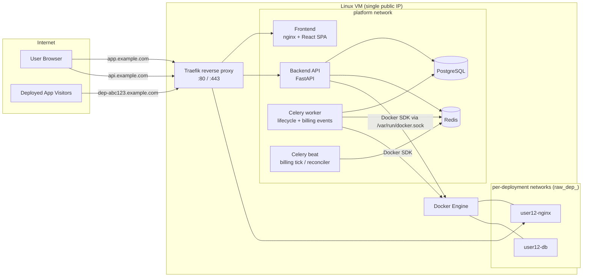

# Rent-a-Whale — Architecture

Rent-a-Whale is a single-VM container rental platform: users buy credits, deploy Docker
images or Compose stacks, and reach them through public subdomains. This document is the
authoritative description of the system design and the reasoning behind it.

## 1. System overview



Components:

| Component  | Role |
|------------|------|
| Traefik    | Single ingress. Routes platform traffic and every tenant deployment by subdomain. TLS termination, Let's Encrypt-ready. |
| Backend    | FastAPI. Auth, credits, cost estimation, deployment orchestration through the `DeploymentProvider` abstraction. |
| Worker     | Celery. Consumes lifecycle events (billing, audit, notifications), executes async deploy/teardown. |
| Scheduler  | Celery beat. Per-minute billing tick, credit-exhaustion enforcement, Docker/DB state reconciliation, host resource sampling. |
| PostgreSQL | Authoritative state: users, credits, deployments, usage, audit. |
| Redis      | Celery broker/result backend, rate-limit counters, token-revocation denylist, cached host metrics. |

## 2. Architectural decisions

### ADR-1: `DeploymentProvider` abstraction

All orchestration goes through an abstract interface
(`backend/app/providers/base.py`):

```
DeploymentProvider
    ├── DockerProvider          (today: local Docker Engine via docker SDK)
    └── KubernetesProvider      (future: same contract, different backend)
```

The service layer never imports the `docker` package directly. The provider owns
networks, volumes, containers, logs, stats, and health. Provider selection is a config
value (`DEPLOYMENT_PROVIDER=docker`), so multi-VM or Kubernetes backends are a new
implementation plus a scheduler for placement — no changes to services, billing, or API.

### ADR-2: Compose without shelling out

`docker compose` is a CLI; the Docker SDK has no compose support. Shelling out to a CLI
with user-controlled YAML is an injection and audit nightmare, so we do not do it.

Instead the backend ships a **compose interpreter** (`app/providers/docker/compose_interpreter.py`):

1. Parse YAML with `yaml.safe_load` (hard size cap, no anchors bombs — depth/size limited).
2. Validate against a strict Pydantic model of the **supported compose subset**.
3. Run the security validator (reject privileged, host network, bind mounts, docker.sock,
   added capabilities, `pid: host`, devices, sysctls, userns, cgroup access…).
4. Materialize the stack as ordinary SDK calls: one dedicated network, named volumes,
   one container per service, `depends_on`-ordered startup with healthcheck gating.

**Supported subset:** `image`, `command`, `entrypoint`, `environment`, `ports`
(container-side only — used for routing, never published to the host), `volumes` (named
volumes only), `depends_on`, `restart`, `healthcheck`, `labels`,
`deploy.resources.limits`.

**Trade-offs (explicit):**
- `build:` is rejected — users deploy prebuilt images only (build on a rented host is a
  security and disk-quota problem; a future image-builder service can add it).
- Compose features outside the subset (profiles, extends, secrets, configs, multiple
  networks per stack) are rejected with a clear validation error rather than silently
  ignored.
- We gain: no subprocess, single code path for image and compose deployments, security
  validation that cannot drift from execution, uniform labels/limits/billing per service.

### ADR-3: Event-driven lifecycle with an authoritative DB

Every lifecycle transition (`created`, `provisioning`, `running`, `stopped`, `failed`,
`deleted`, `credit_exhausted`) is:

1. Written to `deployment_events` inside the same DB transaction that changes state
   (transactional outbox — an event is never lost, never emitted for a rolled-back change).
2. Dispatched to Celery via Redis for consumers: **billing** (open/close usage records),
   **audit** (append audit log), **notifications** (email placeholder).

Docker's own event stream is *not* the source of truth. A periodic **reconciler**
compares provider reality against DB expectations and repairs drift (container died →
mark deployment `failed`, close its billing period; container exists with no DB row →
quarantine and remove).

### ADR-4: Billing model

Credits are integers (1 credit = smallest billable unit). Pricing lives in the
`pricing_plans` table (per-CPU/hour, per-GB-RAM/hour, per-GB-storage/hour, base
service fee) and is fully configurable by admins.

- **Estimation** (`POST /deployments/estimate`) uses the active plan; the wizard shows
  hourly/daily/monthly figures and the API re-checks affordability at deploy time
  (minimum balance: 1 hour of estimated cost).
- **Metering**: the beat scheduler runs a per-minute `billing_tick`. For every running
  deployment it computes the minute's cost from the *usage record's frozen price
  snapshot* (price changes never retroactively re-price running workloads), inserts a
  `credit_transactions` debit, and updates the account balance — all in one transaction
  with row-level locking (`SELECT … FOR UPDATE`) so concurrent ticks/purchases are safe.
- **Exhaustion**: if a debit would take the balance below zero, the tick charges what
  remains, emits `credit_exhausted`, and enqueues an async stop of the deployment.
- **Idempotency**: usage records carry a `(deployment_id, period_start)` unique key; a
  re-delivered tick cannot double-charge.

### ADR-5: Ingress and isolation

- Each deployment gets its own bridge network `raw_dep_<deployment_id>` with
  inter-container communication disabled between stacks. Compose services within a stack
  share that one network and resolve each other by service name.
- Nothing publishes host ports. The service the user marks as "web" is attached to the
  shared `raw_ingress` network and labeled for Traefik:
  `Host(\`dep-<id>.<PLATFORM_DOMAIN>\`)`. Traefik's Docker provider watches labels — no
  proxy reload, no port collisions.
- Every tenant container runs with: cpu quota (`nano_cpus`), `mem_limit`,
  `pids_limit`, `no-new-privileges`, all capabilities dropped except a safe minimum,
  read-only rootfs optional per deployment, named volumes only, and a
  storage quota (`storage_opt` when the daemon supports it, otherwise enforced by the
  reconciler's disk sampling).
- Names/labels: containers are `user{id}-{name}` and every object carries
  `raw.managed=true`, `raw.user_id`, `raw.deployment_id` labels — the reconciler and
  admin tooling operate on labels, never on name conventions alone.

### ADR-6: Security model

- **Auth**: short-lived JWT access tokens (15 min) + opaque refresh tokens stored
  hashed (SHA-256) in Postgres with rotation and reuse-detection (rotated-token replay
  revokes the whole session family). Logout revokes the session; access tokens are
  denylisted in Redis by `jti` until natural expiry. RBAC (`user`, `admin`) enforced by
  FastAPI dependencies on every route.
- **Passwords**: bcrypt via passlib, with per-user email-verification and password-reset
  token placeholders (single-use, hashed at rest, TTL-bound).
- **Rate limiting**: Redis fixed-window counters per route class (tight on auth,
  moderate on deploy, generous on reads).
- **Input**: Pydantic v2 everywhere; SQLAlchemy 2.0 bound parameters only; image
  references validated against an allowlist/blocklist table; compose validated per ADR-2.
- **CSRF**: the SPA sends JWTs via the `Authorization` header (no auth cookies), which
  is CSRF-immune; strict CORS allowlist for the platform origin.
- **Secrets**: environment only (`.env` for compose), nothing hardcoded; example file
  ships with `CHANGE_ME` sentinels and the backend refuses to boot with them in
  production mode.
- **Docker socket**: the backend/worker mount `/var/run/docker.sock` — root-equivalent
  on the host. This is the fundamental trade-off of a single-VM design; mitigations are
  the validator (no user-controlled privileged/bind-mount paths), the allowlist, and the
  provider being the only module with socket access. A future hardening step is a
  socket-proxy (e.g. tecnativa/docker-socket-proxy) or rootless Docker.

### ADR-7: Future-proofing hooks

Already shaped for: multiple VMs / Kubernetes (ADR-1 + `node_id` on deployments),
teams/orgs (ownership is via `owner_id` FK, easily generalized to a polymorphic owner),
API keys (auth dependency already token-kind aware), webhooks (event consumers are
pluggable), Stripe/PayPal (payments go through a `PaymentGateway` interface with a
`FakeGateway` today), GPU (resource spec is an extensible model), marketplace
(`compose_templates` table with approval workflow exists now).

## 3. Backend layering

```
routers/        HTTP only: parse, authorize, delegate, serialize
services/       business rules, transactions, event emission
repositories/   persistence (SQLAlchemy 2.0), no business logic
providers/      DeploymentProvider + Docker implementation + compose interpreter
billing/        pricing engine, estimator, metering
workers/        Celery app, lifecycle consumers, beat tasks
models/         SQLAlchemy ORM
schemas/        Pydantic v2 request/response DTOs
core/           config, security, logging, rate limit, DB session, DI wiring
```

Dependency rule: `routers → services → repositories/providers/billing`. Nothing imports
upward. Services receive their dependencies through constructor injection wired by
FastAPI `Depends` factories in `core/deps.py`, so every layer is unit-testable with fakes.

## 4. Request/worker topology

- API pods are stateless; all coordination is Postgres (row locks) + Redis (Celery,
  rate limits, denylist).
- Long operations (create/stop/delete a stack, image pulls) run in the worker; the API
  returns `202` with the deployment in `provisioning`/`stopping` state and the frontend
  polls status + streams logs.
- Log streaming: `GET /deployments/{id}/logs` supports snapshot and follow (chunked
  streaming from the provider) — deployment logs never pass through the DB; lifecycle
  *events* do.
```
