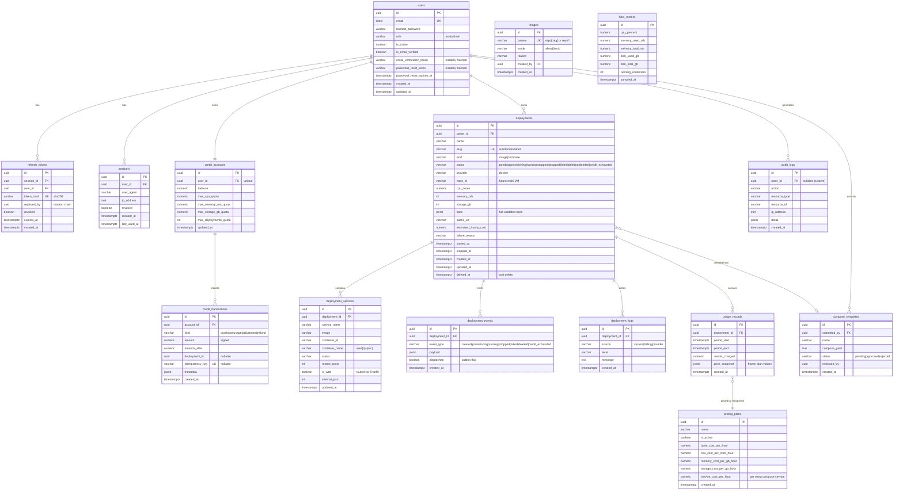

# Database design

PostgreSQL, normalized. All IDs are UUIDv4. All timestamps are `timestamptz` (UTC).
Money/credits are `NUMERIC(18,4)` — never floats.

## ER diagram



## Invariants enforced in code + constraints

- `credit_transactions.balance_after` is always written under `SELECT … FOR UPDATE` of
  the account row; `CHECK (balance >= 0)` on `credit_accounts` is the last line of defense.
- `usage_records (deployment_id, period_start)` unique — the billing tick is idempotent.
- `deployments.slug` unique — it is the public subdomain label.
- Deployments are soft-deleted (`deleted_at`) so billing history keeps its FK integrity.
- `deployment_events` is a transactional outbox: rows are inserted with the state change
  and `dispatched=false`, then relayed to Celery; the relay marks `dispatched=true`.
```
