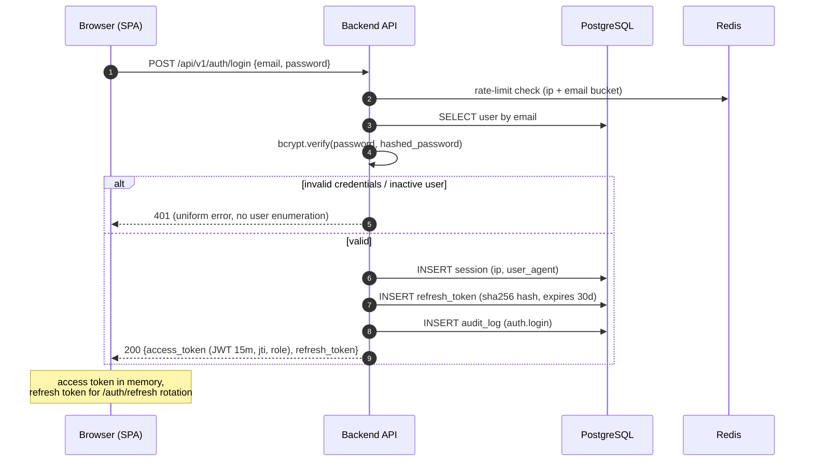
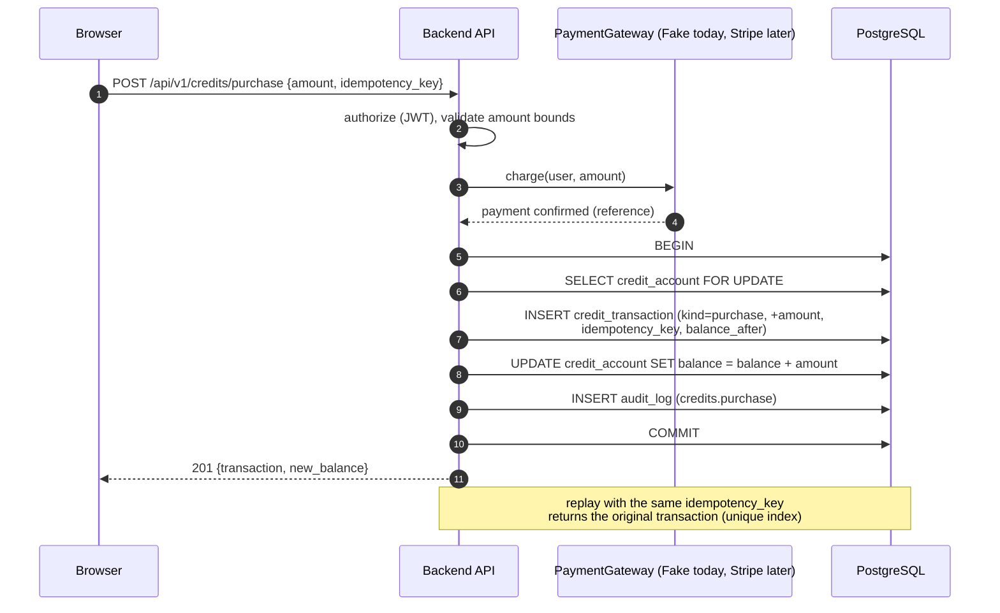
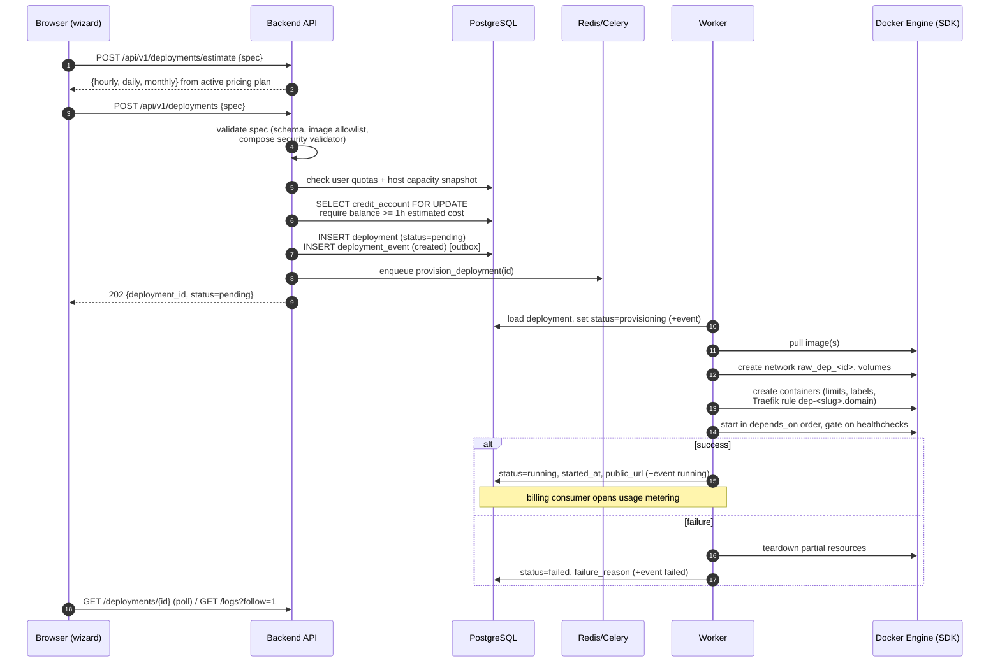
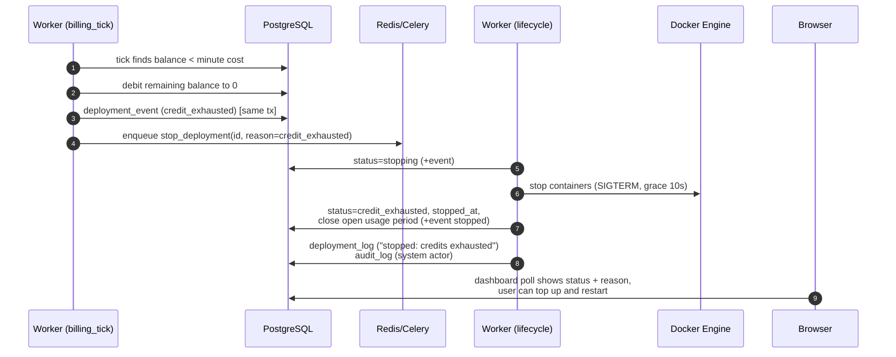

# Sequence diagrams

## 1. User login



## 2. Credit purchase



## 3. Deployment creation



## 4. Billing lifecycle

```mermaid
sequenceDiagram
    autonumber
    participant S as Celery beat (scheduler)
    participant W as Worker
    participant PG as PostgreSQL
    participant D as Docker Engine

    loop every minute
        S->>W: billing_tick
        W->>PG: SELECT running deployments
        loop each running deployment
            W->>PG: BEGIN; SELECT credit_account FOR UPDATE
            W->>W: cost = minute_fraction(price_snapshot, cpu, mem, storage, services)
            alt balance >= cost
                W->>PG: INSERT usage_record (period unique) + debit transaction
                W->>PG: UPDATE balance; COMMIT
            else insufficient
                W->>PG: charge remainder to 0, event credit_exhausted; COMMIT
                W->>W: enqueue stop_deployment(id, reason=credit_exhausted)
            end
        end
    end
    loop every 2 minutes (reconciler)
        S->>W: reconcile_deployments
        W->>D: list containers with raw.managed=true
        W->>PG: compare against DB expectations
        W->>PG: dead container → status=failed, close billing (+event)
        W->>D: orphan container → stop & remove, audit log
    end
```

## 5. Shutdown on insufficient credits


